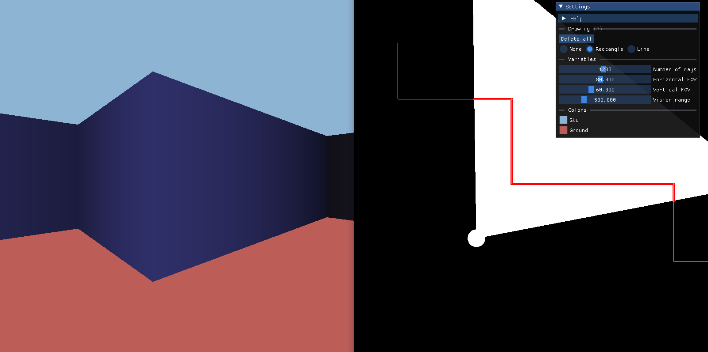

# Raycast

Программа использует алгоритм рейкастинга для создания 3D-иллюзии в 2D-окружении. Алгоритм рейкастинга работает путем проецирования лучей из точки обзора игрока и определения пересечений с объектами в сцене. Это позволяет создать впечатление трехмерного пространства и управлять отображением стен.

* Рисование с помощью библиотеки SFML.
* GUI реализован с помощью ImGUI.

## Управление:
* WASD движение
* <- -> поворот

